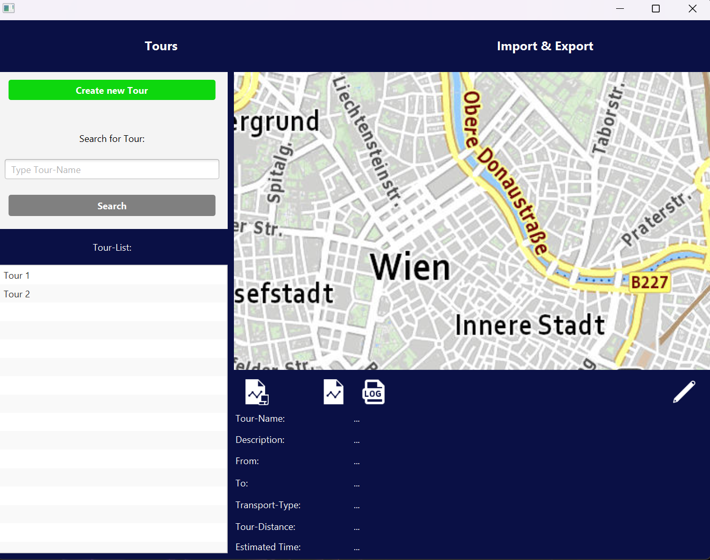
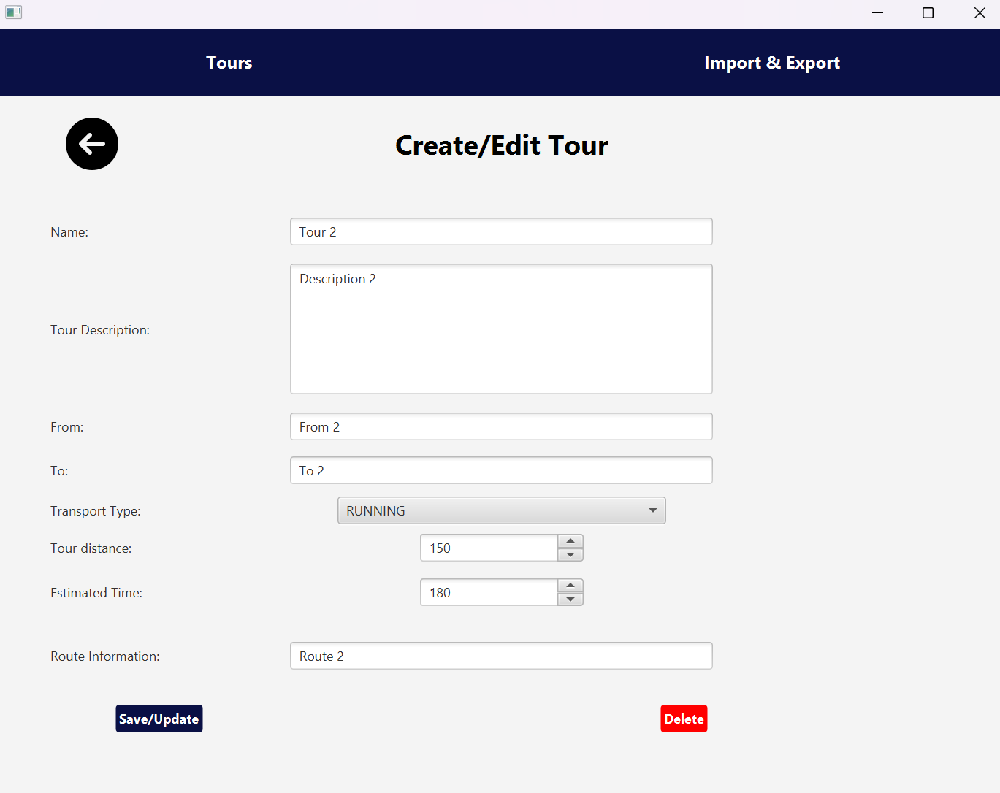
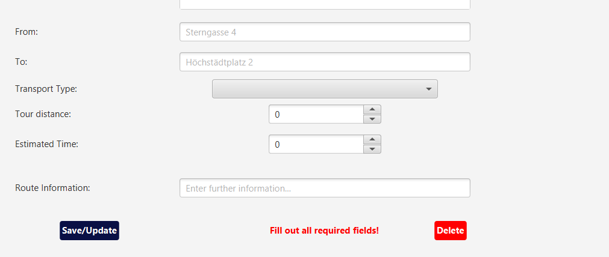
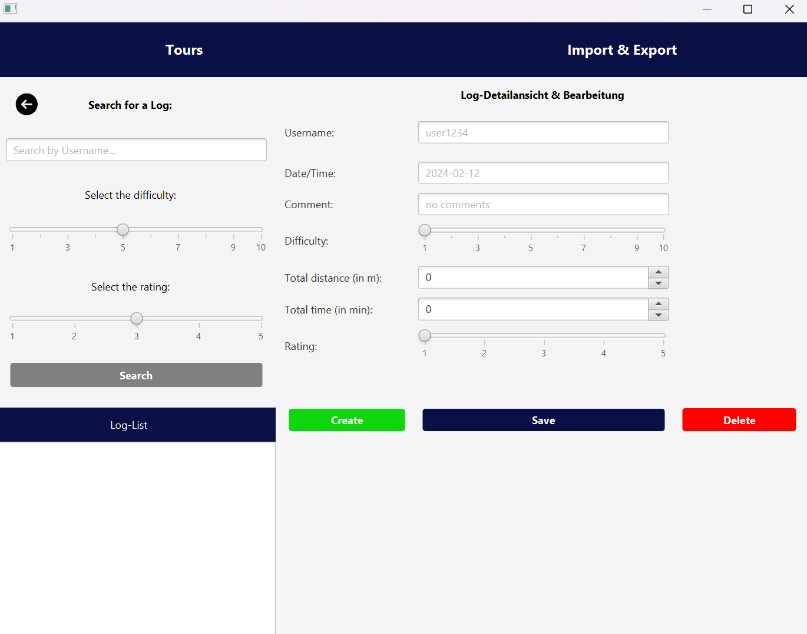
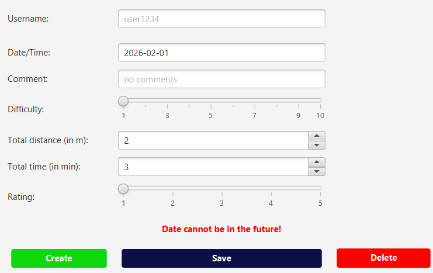
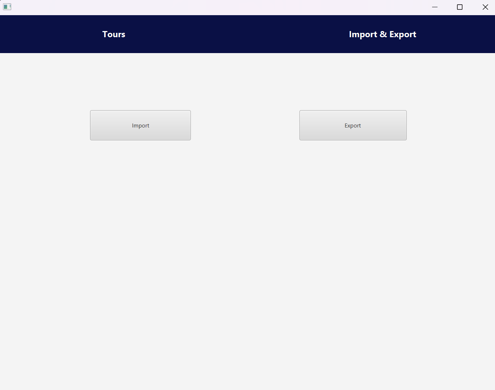

# Protocol - Describing UX

We divided our application into four main screens:
- home-screen (tours)
- create/edit tours
- logs (create/read/update/delete)
- import/export

### home-screen

#### Features
- see all Tours in the left-sided Tour-List
- click on one Tour in the Tour-List
- - then see all tour-information on the right bottom of the screen
- - then a reports can be created (to be done)
- - then all logs can be seen for this specific tour
- - then the tour can be edited
- (future:) we want to make the tour-list searchable with searching for the Tour-Name
- when clicking on "Create new Tour" we come to the next screen "create/edit tours"

### create/edit tours

#### Features
- when creating a new Tour all fields are empty
- when editing a tour all fields are preset with the corresponding value
- only existing tours in the tour-list can be deleted
- when leaving blank fields, an error message gets displayed
- - 

### logs

#### The user can...
- create a new log
- save updates for an existing log
- delete an existing log
- search for a log (to be done in future)
- can view all logs to one tour in the "Log-List"
- get error messages when inputting wrong data or leaving blank fields
- - 

### import/export

- not implemented yet
- the user can import and export tour-data and log-data